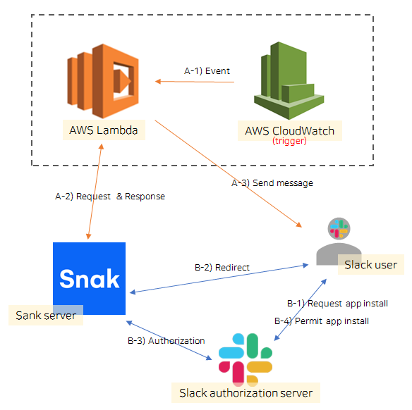

# 슬랙 봇 만들기
## 요구사항
메시지를 보내는 슬랙봇을 제작한다
- 매 정해진 시간마다
- (핵심1) [SNAK뉴스]()의 조건에 맞는 article을 정리한 메시지를
- (핵심2) 해당 슬랙 봇이 설치된 채널에 송신할 수 있다

## 목표

### 1. 앱 설치 및 배포
- 설치 인증 과정 구현
- 설치한 채널의 정보를 DB에 저장

### 2. 메시지 보내기
- 서버에 저장된 정보를 기반으로 메시지 보내기

## 사용 Tech stack

### 이번 구현을 위한 것
- AWS Lambda
- AWS CloudWatch

### 기존 구현
- Java
- Spring boot
- MySQL
- Spring JPA

## 큰 그림

아마 대략적으로 이런 그림이 되지 않을까 싶은데, 추후에 자세히 그려봐야겠다

## 인증
